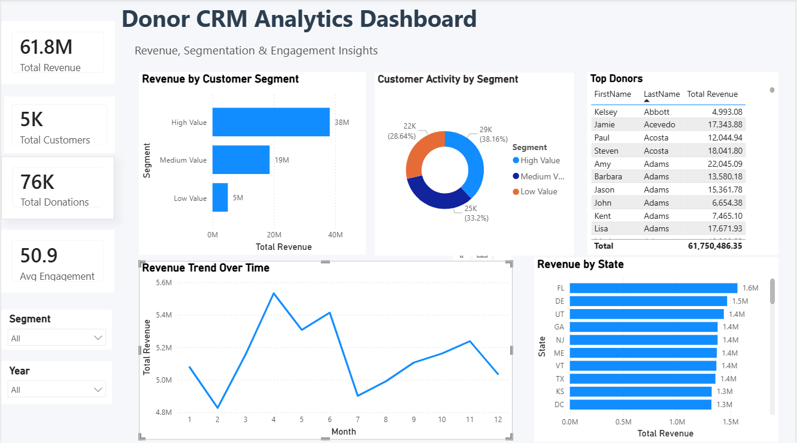

# Donor CRM Analytics & Power BI Dashboard

## Project Overview

In this project, I worked with a CRM donor dataset to analyze customer behavior, identify revenue patterns, and build an interactive Power BI dashboard.

I cleaned and transformed the data using Python, created new features for analysis, and designed a dashboard that highlights key insights such as customer segmentation, engagement, and geographic performance.

## What I Did

- Cleaned and prepared raw donor data (date formatting, removing duplicates)
- Extracted **Year** and **Month** from donation dates for trend analysis
- Created a **Customer Segment** column (High, Medium, Low) based on donation amounts
- Analyzed revenue distribution, donor activity, and top contributors
- Built a Power BI dashboard with interactive visuals and filters

## Dashboard Features

- KPI Cards: Total Revenue, Customers, Donations, Engagement  
- Revenue Trend Over Time (Monthly)  
- Revenue by Customer Segment  
- Customer Activity (Total Gifts) by Segment  
- Revenue by State  
- Top Donors Table  
- Interactive Filters (Segment, Year)  

## Key Insights

- **Revenue is highly concentrated**: High-value donors contribute most of the revenue  
- **Monthly trends fluctuate**: Identifying peak periods helps plan campaigns  
- **Engagement matters**: More engaged donors tend to give more  
- **Geographic patterns**: A few states generate a large share of revenue  

## Tools Used

- Python (pandas, numpy)  
- Power BI  
- Git & GitHub  

## Dashboard Preview

Below is the Power BI dashboard created from the CRM dataset:



## 🔁 How to Reproduce

1. Open and run the analysis notebook:

```bash
notebooks/crm_analysis.ipynb
```

2. This will generate the cleaned dataset:

```bash
data/processed/cleaned_crm_data.csv
```

3. Load the dataset into Power BI:

- Open **Power BI Desktop**
- Click **Get Data → Text/CSV**
- Select the cleaned CSV file
- Build visuals based on the dataset

---

##  Project Structure

```
crm-powerbi-dashboard/
├── data/
│   ├── raw/
│   └── processed/
├── notebooks/
├── dashboard/
├── images/
└── README.md
```


## Author

**Asres Gamu Yelia** 
 
*Power BI Specialist | Data Analytics & Business Insights*